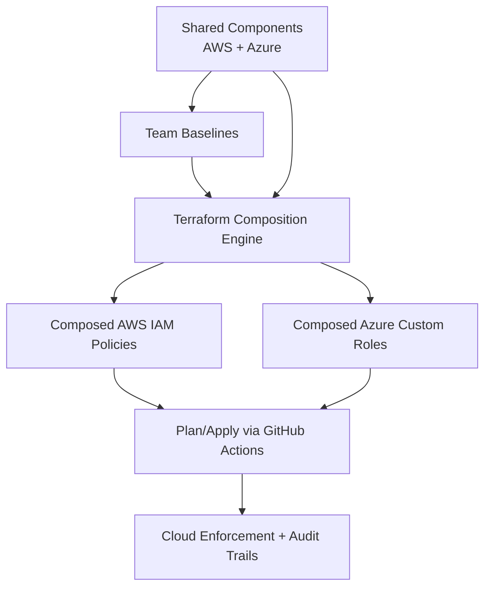

# Architecture

## Goal

Provide composable IAM governance across AWS and Azure using policy-as-code, shared guardrails, team overlays, and reviewable Terraform changes.

## Design principles

- Composition over duplication
- Least privilege with operational usability
- Explicit guardrails for destructive and identity-risk actions
- Environment-aware strictness
- Auditable CI/CD workflow with OIDC and approvals

## High-level flow

## AWS composition

- Shared components are loaded from `aws_policies/components/*.json`.
- Team policy files are loaded from `aws_policies/*.json`.
- In strict governance mode, shared components are concatenated with team baselines.
- `devops-external-l2` inherits `devops-external-l1` baseline statements.
- `devops-internal` remains direct and bypasses shared component injection.

## Azure composition

- Shared components are loaded from `azure_roles/components/*.yaml`.
- Team role files are loaded from `azure_roles/*.yaml`.
- Component `actions` and `notActions` are merged into team roles.
- `devops-external-l2` inherits `devops-external-l1` actions/notActions.
- Composed role definitions are created through `azurerm_role_definition`.

## Guardrail model

- **Hard deny** for high-risk identity and data/crypto destruction where appropriate.
- **MFA-gated delete pattern** for selected human-operated delete actions:
  - Allow action when MFA present.
  - Explicit deny when MFA absent.
- **Scoped pass-role** patterns for workload role delegation.

## Delivery pipeline

- PR workflow runs `terraform init`, `validate`, and `plan`.
- Merge to main runs `terraform apply` in a protected environment.
- Authentication is handled through AWS/Azure OIDC federation (short-lived credentials).

## Current limitations / assumptions

- Final effective access depends on org-level controls (SCPs, Azure management group policies).
- Resource tagging and account/subscription structure affect real-world blast radius.
- Some service APIs still require wildcard families for practical operations.
